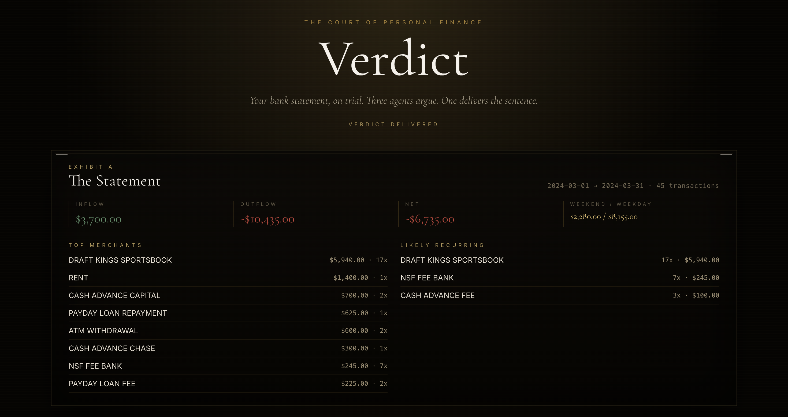

# Verdict

> Any decision. On trial.

Submit a decision in plain language, or upload a document — PDF, DOCX, or CSV.
Three AI agents argue it before the bench:



- **The Pessimist** — prosecution. Finds every flaw, risk, and red flag.
- **The Optimist** — defense. Reframes the case and defends the human behind it.
- **The Judge** — delivers a final verdict after three rounds.

Works for anything: life decisions, career moves, contracts, lease agreements,
academic drafts, financial choices. Built with Next.js 14 (App Router),
Tailwind, and the Anthropic SDK using `claude-sonnet-4-20250514`.
Token-by-token streaming straight from the API to the courtroom UI.

## Quick start

```bash
cp .env.local.example .env.local
# paste your key into .env.local
npm install
npm run dev
```

Open <http://localhost:3000>. Describe a decision in the question box, drop in
a PDF / DOCX / CSV as supporting evidence, or do both — then convene the court.

## Environment

| Variable | Required | Purpose |
| --- | --- | --- |
| `ANTHROPIC_API_KEY` | yes | Server-side key used by `/api/debate`. Never exposed to the client. |

## How it works

```
Question + File  ─►  /api/debate (Node runtime)
                          │
                          ├─ Detect file kind (PDF / DOCX / CSV)
                          ├─ Extract text via pdf-parse / mammoth / papaparse
                          ├─ Build a structured Exhibit (situationToBrief)
                          ├─ Stream Pessimist → Optimist  × 3 rounds
                          └─ Stream Judge with the full transcript
                                    │
                                    ▼
                            NDJSON event stream
                                    │
                                    ▼
                          Courtroom.tsx (React client)
```

### The streaming protocol

The API responds with newline-delimited JSON. Each line is one event:

| `type` | Payload | Meaning |
| --- | --- | --- |
| `summary` | `{ exhibit: Exhibit }` | Parsed exhibit (CSV summary or freeform text + question). Sent once at the start. |
| `turn_start` | `{ role, round }` | A new turn is beginning. |
| `delta` | `{ role, round, text }` | A token chunk for the active turn. |
| `turn_end` | `{ role, round }` | The current turn has finished. |
| `done` | `{ verdict: { label, line } \| null }` | All seven turns complete. |
| `error` | `{ message }` | Something went wrong mid-trial. |

The `Exhibit` is a discriminated union:

```ts
type Exhibit =
  | { kind: "summary"; summary: StatementSummary; question: string | null; fileName: string }
  | { kind: "text"; text: string; source: "pdf" | "docx" | "text"; question: string | null; fileName: string | null };
```

### Input rules

- **Text question** — any plain-language description of the matter. Up to ~8k characters.
- **File upload** — `.pdf`, `.docx`, or `.csv`. 8 MB max.
- **Both** — the question becomes EXHIBIT A, the file becomes EXHIBIT B.
- **Either alone** — works, but the court rewards detail.

### CSV expectations (when uploading a bank statement)

The parser auto-detects common header names:

- **Date** — `date`, `posted`, `posting date`, `transaction date`, …
- **Description** — `description`, `details`, `memo`, `narration`, `payee`, …
- **Amount** — either a signed `amount` column, or separate `debit` / `credit`
  columns. Negative values, parentheses, and `$`/`,` are all handled.
- **Category** *(optional)* — used as a hint for the briefs.

Only an aggregated brief (top merchants, recurring charges, inflow/outflow,
etc.) is ever sent to Claude — never the full row dump.

### PDF / DOCX expectations

- PDFs are parsed with `pdf-parse` v2 (pdfjs under the hood). Scanned/image-only
  PDFs will return no text — paste the relevant content into the question box
  instead.
- DOCX files are parsed with `mammoth`'s `extractRawText`.
- Either way, the extracted text is truncated to ~24k characters before it
  enters the brief, to keep prompts manageable.

## Architecture

```
app/
  layout.tsx           # Fonts (Cormorant Garamond + Inter + JetBrains Mono)
  page.tsx             # Hosts <Courtroom />
  globals.css          # Dark editorial theme, chamber frames, gold ornaments
  api/debate/route.ts  # Streaming orchestrator
components/
  Courtroom.tsx        # Top-level state machine + stream reader
  ExhibitA.tsx         # Renders question + evidence (summary or freeform)
  AgentBench.tsx       # Pessimist / Optimist panels (with round tickers)
  JudgeBench.tsx       # Judge panel
  VerdictReveal.tsx    # Final stamped sentence
  FileUpload.tsx       # Dual input: question textarea + file drop zone
lib/
  agents.ts            # Topic-agnostic system prompts + per-turn user prompts
  csv.ts               # papaparse parser, summarizer, situationToBrief
  extract.ts           # PDF (pdf-parse) + DOCX (mammoth) extractors
```

## Verdict criteria

The Judge issues one of three labels:

- **NOT GUILTY** — the decision is sound, risks are manageable, and the case
  for proceeding is stronger than the case against.
- **GUILTY WITH MERCY** — real concerns exist but they are fixable; the human
  behind the decision deserves a chance to address them.
- **GUILTY** — the decision is clearly harmful, reckless, or has no defensible
  upside.

## Notes & limitations

- The page route is server-rendered on demand; the API route runs in the Node
  runtime so the Anthropic SDK can stream over HTTPS and `pdf-parse` / `mammoth`
  can read binary buffers.
- A trial is roughly 7 model calls (3 × 2 + Judge), each capped at ~600 tokens
  (Judge 900). Expect ~30–60 seconds end-to-end depending on latency.
- This app is a piece of theater, not legal or financial advice.

## Scripts

| Command | Purpose |
| --- | --- |
| `npm run dev` | Dev server with HMR |
| `npm run build` | Production build |
| `npm run start` | Run the production build |
| `npm run lint` | Lint with Next's config |
